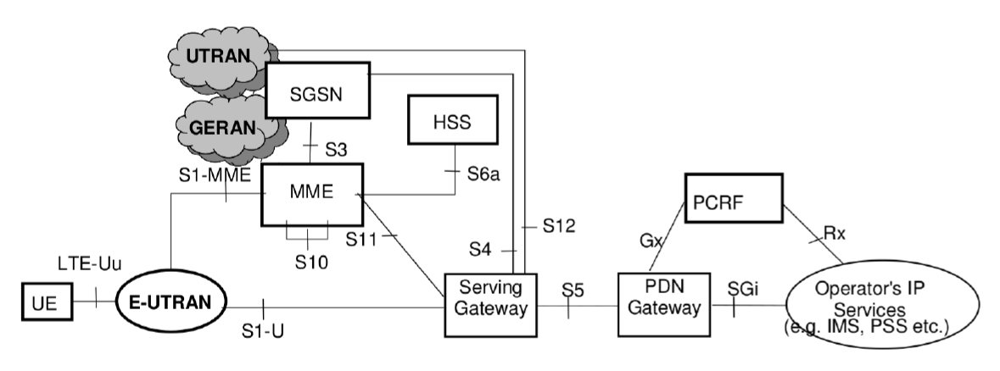

<table style="border-collapse: collapse; border: none;">
  <tr style="border-collapse: collapse; border: none;">
    <td style="border-collapse: collapse; border: none;">
      <a href="http://www.openairinterface.org/">
         
         </img>
      </a>
    </td>
    <td style="border-collapse: collapse; border: none; vertical-align: center;">
      <b>OpenAirInterface Core Network Feature Set</b>
    </td>
  </tr>
</table>

**Table of Contents**

1. [OpenAirInterface Core Network Block Diagram](#1-openairinterface-core-network-block-diagram)
2. [OpenAirInterface Core Network Fundamentals](#2-oai-core-network-fundamentals)
3. [OpenAirInterface Core Network Deployment](#3-oai-core-network-deployment)
4. [OpenAirInterface SPGW-CUPS Fundamentals](#4-oai-spgw-cups-fundamentals)
5. [OpenAirInterface SGW Feature List](./FEATURE_SET_SGW.md)
6. [OpenAirInterface PGW Feature List](./FEATURE_SET_PGW.md)

# 1. OpenAirInterface Core Network Block Diagram #

# 2. OAI Core Network Fundamentals #

*  Network Access Control Functions
   -  Authentication and authorization
   -  Admission control
   -  Policy and charging enforcement
*  Packet Routing and Transfer Functions
   -  IP header compression function
   -  Packet screening.
*  Mobility Management Functions
   -  Reachability management for UE in ECM IDLE state
*  Security Functions
*  Radio Resource Management Functions
*  Network Management Functions (O&M)
   -  GTP C signaling based Load and Overload Control
   -  Load balancing between MME instances
   -  MME control of overload
   -  PDN GW control of overload

# 3. OAI Core Network Deployment #

*  Target OS
   -  Ubuntu 18.04 (bionic) server edition
   -  Red Hat Entreprise Linux 8
*  Hardware Requirements
   -  x86-64 Intel/AMD CPU
   -  At least one 1 network device
*  Linux Kernel
   -  Generic kernel is enough
*  Deployment feasible on:
   -  PC
   -  Server
   -  Container
   -  Virtual Machine

# 4. OAI SPGW-CUPS Fundamentals #

CUPS = Control-User Planes Separation

So SPGW is composed of almost 2 network functions:

*  1 SPGW-C
*  1 SPGW-U

Fully written in C++ (-std=c++17)

*  Internal design still asynchronous (ITTI based API)
*  Usage of submodules: spdlog, libfolly (nolock collections)

Main differences with previous SPGW (tag `v0.7.0`)

*  Handles GTP fragmentation
*  Enables Network Address Translation (NAT), based on iptables
*  Easier to install (no kernel dependencies)
*  Switch-talking natively PFCP
*  Data is copied/handled in user space
